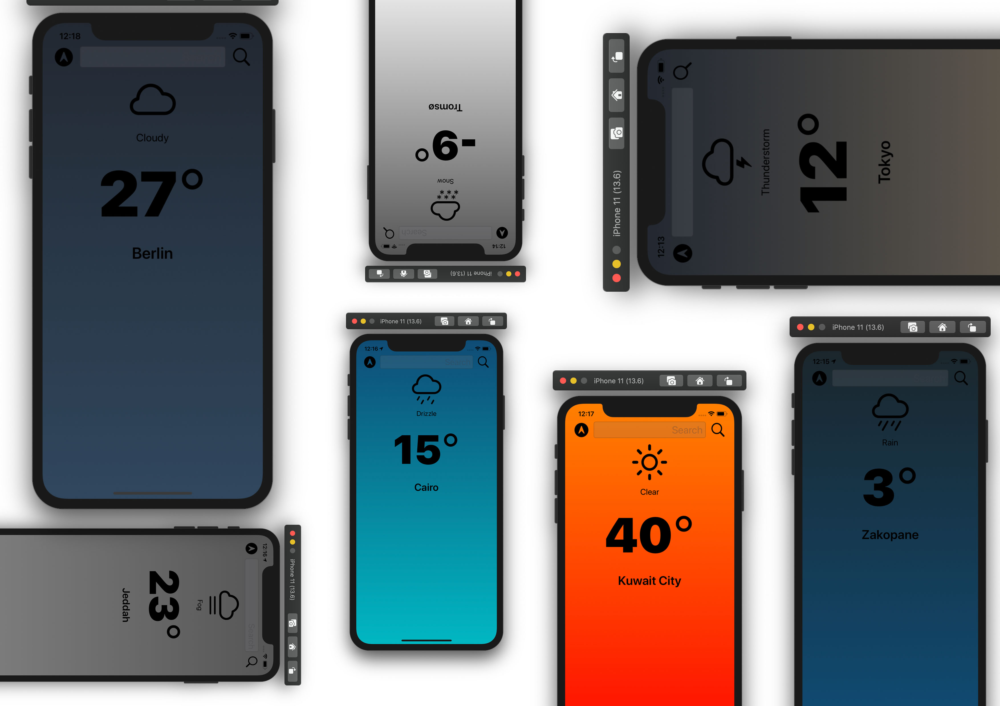

#  Clima iOS 13

## Description

Clima is an iOS 13 weather app that uses OpenWeatherMap API to get weather data. A user can search for a city to get the current temperature and weather condition, or use the device's location to get weather data for where the device is located. The app has a simple UI that represents weather conditions using gradients. More features can be introduced easily like dilsplaying temperature in Fahrenheit, getting weather forecasts, and displaying city suggestions.

